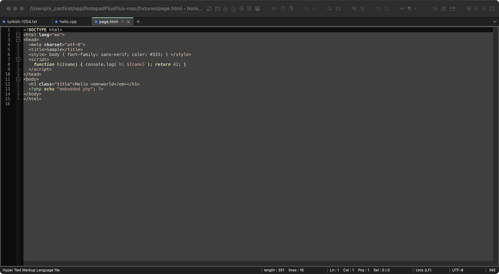
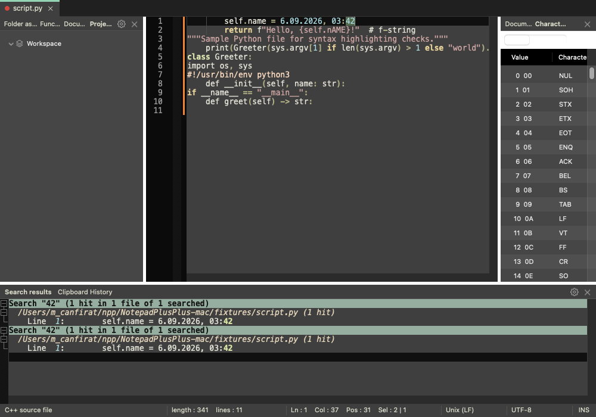
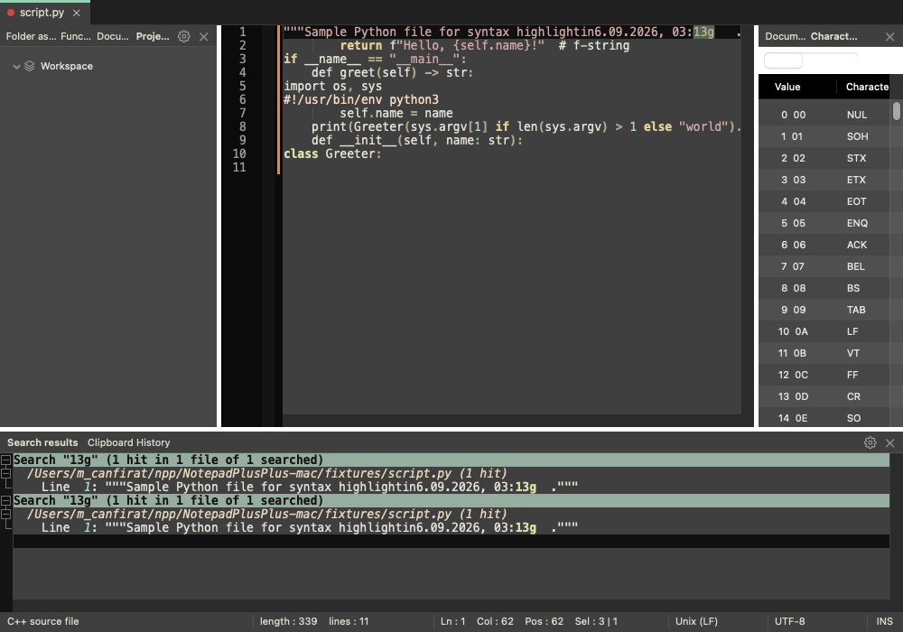
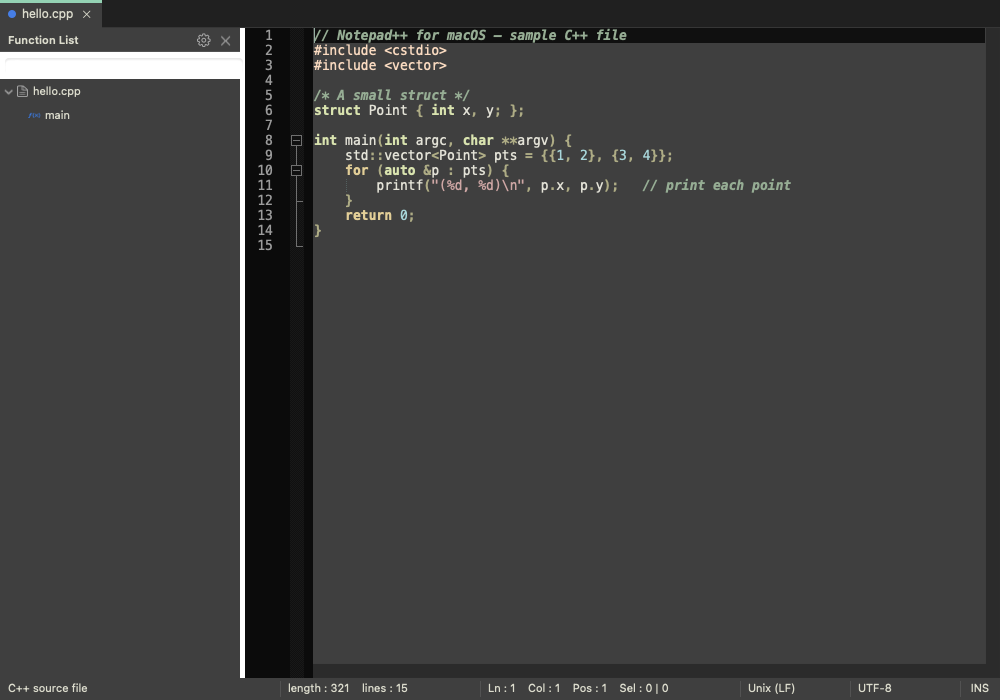

# Notepad++ for macOS

A native macOS port of [Notepad++](https://github.com/notepad-plus-plus/notepad-plus-plus) 8.9.8.

> **Unofficial.** This is not a Notepad++ project release and is not affiliated with or endorsed by
> Don HO or the Notepad++ team. Please report problems here, not to the upstream project.



Of the 657 upstream commands and behaviours audited, **641 are implemented** — the 18 that are not are bound to
Windows, to the plugin DLL API, or to a Scintilla backend feature the Cocoa port does not have. Every one is
listed, with the reason, in [docs/feature-audit.md](docs/feature-audit.md).

Notepad++'s own UI is Win32 through and through (90+ source files include `windows.h`), so a
line-by-line port is not possible. What *is* portable — and what makes Notepad++ feel like
Notepad++ — is its editing engine and its data:

| Reused from the Notepad++ tree | How |
|---|---|
| Scintilla 5.6.6 (editor component) | Built as `Scintilla.framework` from `scintilla/cocoa` (the official Cocoa backend) |
| Lexilla 5.5.3 (142 lexers, incl. N++'s `LexUser`, `LexObjC`, `LexSearchResult`) | Compiled as a static library (`compat/windows.h` stub replaces the one Win32 call) |
| uchardet (charset detection) | Compiled as a static library |
| `langs.model.xml`, `stylers.model.xml`, `themes/*.xml` | Bundled as resources and parsed at runtime — same keywords, colours and 23 themes as on Windows |
| Language ↔ lexer wiring, keyword lists, substyles, lexer properties | Ported from `ScintillaEditView.cpp` (`defineDocType` and every `set*Lexer`) |
| Edit/Search/View command semantics, encodings, EOL handling, status bar, tabs | Re-implemented in Cocoa (Objective-C++) against the Notepad++ sources |

## Build

Requirements: Xcode command line tools, Python 3 with Pillow (icon conversion only).

```bash
git clone --depth 1 https://github.com/notepad-plus-plus/notepad-plus-plus.git
cd NotepadPlusPlus-mac          # this directory, next to the clone
make -j$(sysctl -n hw.ncpu)     # -> dist/Notepad++.app (universal arm64 + x86_64)
make run                        # build and launch
make selftest                   # headless self-test (156 checks)
```

`NPP=/path/to/notepad-plus-plus make` if the clone lives elsewhere.

## Install

```bash
make install                    # -> /Applications/Notepad++.app, ready to launch
```

The app is **ad-hoc signed** — there is no Apple Developer ID behind it — so a copy that arrives by download
(the DMG, a zip, AirDrop) is quarantined and macOS refuses to start it: *"Notepad++ is damaged and can't be opened."*
That is Gatekeeper, not a broken build. Drag the app to `/Applications`, then clear the quarantine flag once:

```bash
xattr -dr com.apple.quarantine /Applications/Notepad++.app
```

`make install` copies and clears it in one step; the DMG ships the same instructions in *OKU - READ ME.txt*.

Other targets: `make exercise` (headless GUI sweep: validates all 648 menu items, applies all 95 languages and
23 themes, runs ~84 editor commands and opens every panel), `make dialogs` (opens and dismisses every dialog, with a
watchdog so a modal that blocks fails instead of hanging), `make screenshot` (writes two images of the main window with no Screen Recording permission:
`build/screenshot.png` through the print path, which re-runs every `drawRect:`, and `build/screenshot-onscreen.png`,
the real composited pixels — only the second one shows a view painting over its siblings), `make dmg`.
The app also honours `--selftest` and the `NPP_EXERCISE=1`, `NPP_EXERCISE_DIALOGS=1` and `NPP_SCREENSHOT=/path/out.png`
debug hooks.

## Features

Every Notepad++ panel is here: tabbed editing (with pinning, a tab drop-down and a document peeker), Find/Replace/Mark,
**Find in Files** with a docked search-results view, **Folder as Workspace**, three **Project Panels**, **Function List**
(driven by Notepad++'s own `functionList/*.xml` parsers), **Document Map**, **Document List**, **Clipboard History**,
**Character Panel**, the **Macro** menu, the **Run** menu with `$(FULL_CURRENT_PATH)`-style variables and an output panel,
the **Column Editor**, **User Defined Languages** (the bundled UDL lexer is Notepad++'s own `LexUser`), and syntax-coloured
**printing** through Scintilla's `SCI_FORMATRANGEFULL`.

Beyond those: a **second edit view** with synchronized scrolling and zoom, **periodic backup and crash recovery**,
an **auto-completion** engine (word, API and function completion from the bundled `APIs/*.xml`, parameter hints, path
completion, HTML/XML close tags), a **shortcut mapper**, a **toolbar**, **UI localization** from Notepad++'s own 94
`nativeLang` translations, **MD5/SHA-1/SHA-256/SHA-512** tools, Notepad++'s **command line arguments** (ghost typing
included), and a **Preferences** window covering the upstream page set.



Find in Files writes its results into a docked panel styled with Notepad++'s own `searchResult` lexer, with the same
`Search "x" (N hits in M files of K searched)` grouping, folding and click-to-jump:



The Function List runs Notepad++'s own per-language parser rules, so the same files produce the same outline:



## What works

Tabbed multi-document editing, syntax highlighting for all 95 Notepad++ languages, all 23 themes plus
`stylers.xml`, folding, bookmarks, the five mark styles, smart highlighting, brace matching, change history,
multi-editing, Find/Replace/Mark (normal, extended and regex, with count / replace-all / in-selection /
replace in all open documents), incremental search, Go to line, the full Edit menu (case conversion, 14 sort
variants, line operations, blank operations, comment/uncomment, TAB↔space), encodings (BOM detection, UTF-8,
UTF-16 LE/BE, 45 code pages, uchardet auto-detection, Encode-in vs Convert-to), EOL conversion, file
monitoring (`tail -f`), sessions, recent files, preferences, printing.

A 72 MB / 700k-line log file opens in under 0.3 s.

## macOS adaptations

- Shortcuts use ⌘ (⌘F find, ⌘G / ⇧⌘G next / previous, ⌥⌘F replace, ⌘L go to line, ⌘/ toggle comment,
  ⌘D duplicate line, ⇧⌘↑ / ⇧⌘↓ move line, ⌘1…9 tabs).
- Default EOL for new documents is Unix (LF); default encoding UTF-8.
- The theme follows the system appearance by default (`stylers.xml` in light mode, `DarkModeDefault` in dark);
  any Notepad++ theme can be chosen in Settings ▸ Style Theme.
- Windows default fonts (Courier New / Consolas) map to Menlo; sizes are converted from 96 dpi points.
- Notepad++ falls back to the Windows ANSI code page when charset detection fails; macOS has none, so the
  fallback is derived from the user's locale (a cp1254 file opens correctly in a Turkish region, cp1251 in a
  Russian one, and so on).

## Not ported

A full audit against the upstream menu (669 entries) and the non-menu subsystems is in
[docs/feature-audit.md](docs/feature-audit.md): **657 upstream commands and behaviours examined, 641 implemented,
55 partial, 18 missing** (it was 403 / 40 / 128 before the gap work). File, Edit, Search and Window have no gaps
left. Everything still missing is bound to Windows, to the plugin DLL API, or to a Scintilla backend feature the
Cocoa port does not have:

**Plugins.** Notepad++ plugins are Windows DLLs built against a Win32 `HWND`/message API, so the whole `NPPM_*`
plugin API, Plugins Admin, Import plugin(s), Open Plugins Folder and the plugin-panel session state are absent.

**The Windows auto-updater.** WinGUp, Update Notepad++, Set Updater Proxy and the auto-update preference: this
port has no update channel.

**The system tray.** Minimise-to-tray and the tray action setting have no macOS equivalent.

**RTL/LTR text direction.** Scintilla's Cocoa backend has no bidirectional text support; both menu items stay
disabled.

**Four smaller Windows-isms.** Internet Explorer in View ▸ View Current File in; hiding the menu bar (the macOS
menu bar is not the app's to hide) and its two settings; the Standard (bitmap) toolbar icon set, since every icon
here is an SF Symbol; and Run ▸ Validate shortcuts.xml, since shortcuts live in the defaults database rather than
in that file.

55 further entries are implemented but reduced against upstream — each one is listed with what is missing in the
audit report, and marked in the source with a `ponytail:` comment naming the ceiling and the upgrade path. The
larger ones: the function-list parsers run under ICU regular expressions rather than Boost PCRE (a few of
Notepad++'s heaviest rules are skipped, and files over 8 MB are not parsed), the search results panel drops old
sections past 200k lines, and ghost typing ships four demo scripts rather than upstream's ~200 quotations.

Unavailable menu items are disabled rather than silently ignored, and a preference that nothing honours is shown
disabled with the reason; `make exercise` prints exactly which ones.

The menu audit is exhaustive because it is parsed from the upstream resource file; the behaviour that is *not*
a menu command was swept separately, through six independent readings of the upstream tree — see **Beyond the
menu** in the audit report for the 32 omissions that pass found and closed.

## Layout

```
Makefile              lexilla + uchardet static libs, Scintilla.framework (xcodebuild), app, bundle, codesign
compat/windows.h      stub so LexUser.cxx compiles unmodified
src/                  the Cocoa app (Objective-C++, ARC)
  NPPLanguageManager  langs/stylers XML -> Scintilla (port of defineDocType & friends)
  NPPDocument         buffer: file I/O, encodings (BOM/UTF-8/uchardet), EOL, monitoring, editor behaviours
  NPPEditorWindowController  main window, tabs, status bar, command dispatch
  NPPEditCommands / NPPSearchViewCommands  Edit / Search / View menu operations
  NPPFindPanelController     Find, Replace, Mark, Go to, Incremental search
  NPPTabBarView / NPPStatusBarView          N++-style chrome
  NPPPreferences      settings + Preferences window
  NPPAppDelegate      menus, lifecycle, sessions
  NPPPanelHost        docking area (left / right / bottom) for the feature panels
  NPPFeatureProtocols the seams: NPPPanel, NPPCommandContext, NPPCommandHandler
  NPPFindInFiles      Find in Files + the Search results panel (searchResult lexer)
  NPPFunctionListPanel  functionList/*.xml parsers + the Function List panel
  NPPUserDefinedLanguages  UDL model, apply (LexUser), import/export, editor dialog
  NPPWorkspacePanel / NPPProjectPanel / NPPDocumentMapPanel / NPPUtilityPanels  the docked panels
  NPPMacroManager / NPPRunCommands / NPPColumnEditor / NPPPrintRenderer
  NPPSelfTest         headless test suite
Resources/            Info.plist, npp.icns (converted from npp.ico)
fixtures/             sample files for manual testing
docs/                 screenshots
```

## Licence and credits

GPL-3.0-or-later — this is a derivative work of Notepad++, which is GPL-3.0. The full text is in
[LICENSE](LICENSE), and [NOTICE](NOTICE) records what is reused from where.

Notepad++ is by **Don HO** and its contributors; this port would not exist without it, and it reuses that
project's data files verbatim — the language and styler models, the 23 themes, the function-list parser rules,
the auto-completion API files and the 94 interface translations. Scintilla and Lexilla are by **Neil Hodgson**;
uchardet comes from the **Mozilla Foundation**. None of Notepad++'s Win32 UI code is used: the whole interface is
new Cocoa written against the upstream sources.

## Contributing

`make selftest`, `make exercise` and `make dialogs` must all pass before a change lands — between them they run
156 headless checks, validate all 648 menu items (0 may be unresolved), apply every language and theme, open every
panel and open and dismiss every dialog under a watchdog. Two rules the codebase holds to:

- **No control may look live and do nothing.** A command that cannot run must validate to disabled, and a
  preference nothing honours must be shown disabled with the reason.
- **A deliberate simplification is marked** with a `ponytail:` comment naming the ceiling and the upgrade path,
  so the next reader knows it was a decision rather than an oversight.
